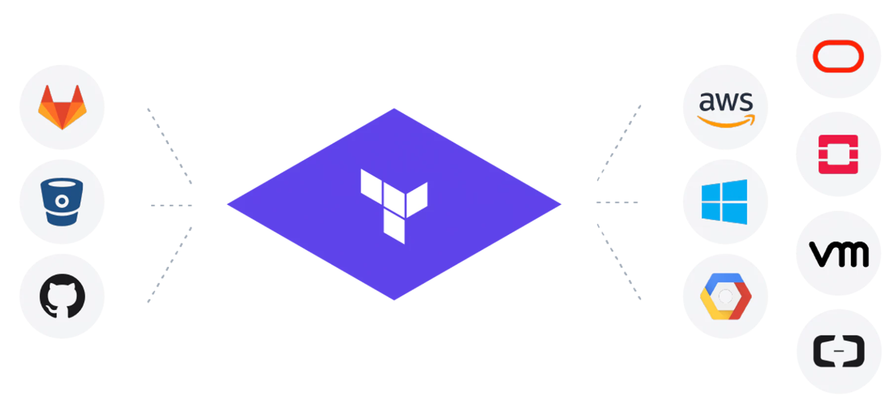
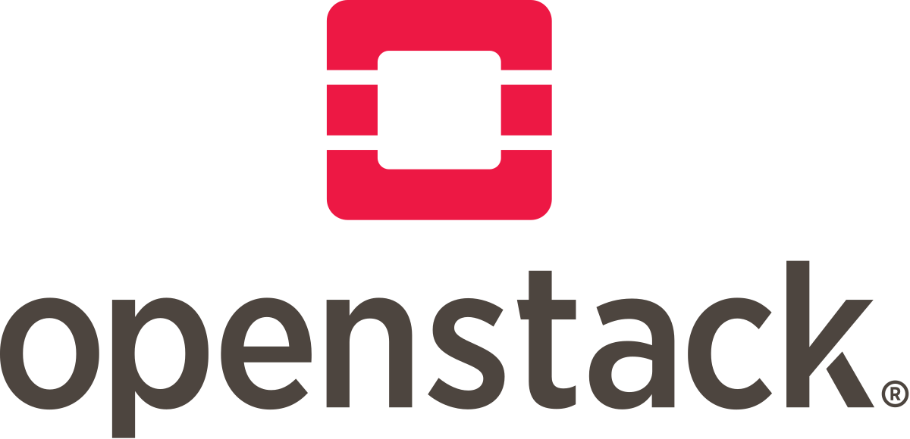

# Openstack-Terraform

:sparkles::fireworks::tada: Important points about this Repository!!!!! :tada::fireworks::sparkles:

- This Repository will contain each and every thing about Openstack through CLI commands & Terraform codes!

* There are multiple operations possible of multiple services of Oepnstack. In this repository major services which are required in Openstack to begin with are covered.

* Operations through CLI commands of each service & Terraform code are covered.

* This repository will be keep on updating in the future as & when I have checked the proper working of each code in my custom environment.

**Not all versions of Openstack are compatible with all version of Terraform!**

**I have used Queens version of Openstack!**

- Brief introduction of Openstack & Terraform is present in their respective sections below!

# What is Openstack?

* Openstack is a stack of services.

* These services correspond to the private cloud services.

* In various versions of Openstack, there is difference in number of services. Therefore according to the requirement select the version of Openstack which you want to install.
