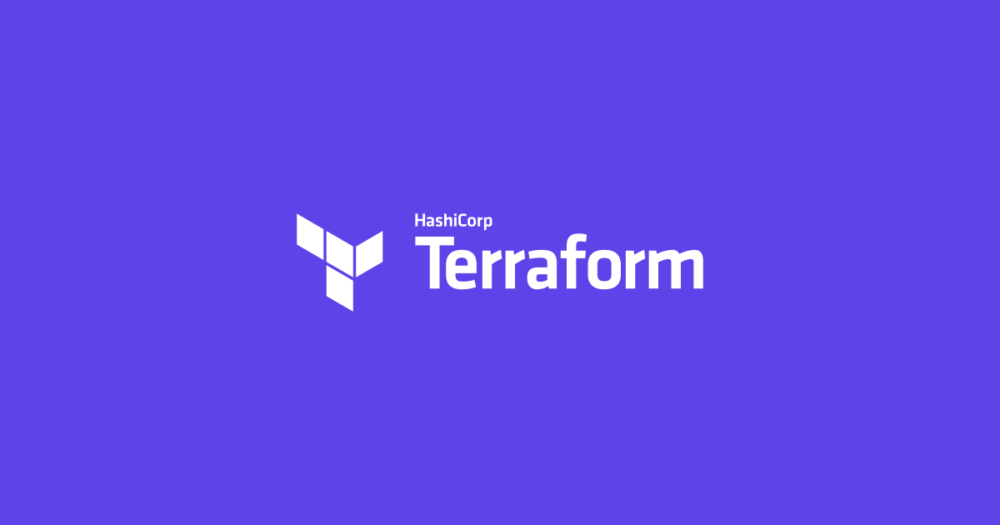

# Openstack-Terraform

:sparkles::fireworks::tada: Important points about this Repository!!!!! :tada::fireworks::sparkles:

* This Repository will contain each and everything about Openstack through CLI commands & Terraform codes!

* There are multiple operations possible of multiple services of Oepnstack. In this repository major services which are required in Openstack to begin with are covered.

* Operations through CLI commands of each service & Terraform code are covered.

* This repository will be keep on updating in the future as & when I have checked the proper working of each code in my custom environment.

**Not all versions of Openstack are compatible with all version of Terraform!**

**I have used Queens version of Openstack for the codes present in this Repository!**

- Brief introduction of Openstack & Terraform is present in their respective sections below!

# What is Openstack?

* Openstack is a stack of services.

* These services correspond to the private cloud services.

* In various versions of Openstack, there is difference in number of services. Therefore according to the requirement select the version of Openstack which you want to install.

* Openstack is an open-source software that has a very large community to support, and that is the reason why Openstack keeps on evolving.
* The benefit of using Openstack cloud is that it provides you the code of the services present in it, & they can be customized according to the requirement! This feature is not available in any other public cloud like AWS, GCP, BlueOcean etc.

**To check out the all the official versions/releases of Openstack click [here!](https://releases.openstack.org/)**

# Some use case of Private Cloud!

* If there is a requirement to store the dataset which is very critical, then private cloud is required, as we cannot take risk of storing that data in the public cloud!

* If there are various compliance in various companies, then private cloud is required.

* If we want to learn the services in depth then private cloud is the only option, because none of the public cloud provides their software, they only provides services.

# What is Terraform?

* Terraform is a provisioning tool.

* It is considered to be a part of DevOps World.

* Terraform is used to provide Infrastructure as a Code (IAAS).

* It is a Idempotent tool i.e. if your Infrastructure is already created, then even if we run the code again, it will not hamper the Infrastructure.

* It is so much powerful & Intelligent tool.

* It is capable of integrating almost all the big giant providers of services, & that list can be checked from [here!](https://www.terraform.io/docs/providers/index.html)

* A glimpse of the power of this tool is by running only command, it can create or destroy all the Infrastructure irrespective of how big the Infrastructure is.

# Running Terraform code!

* First of all Terraform should be installed in the system.

* To run the code, save the file with extension ".tf".

* Make a separate directory/folder for each Terraform script.

* In each directory first of all run this command "terraform init", this will download the Terraform plugins.

* Finally, to run the code, run the command "terraform apply".

* To destroy the environment created by Terraform, run the command "terraform destroy".

# License of this Repository!
To check out the License for this Repository please click [here!](LICENSE)
